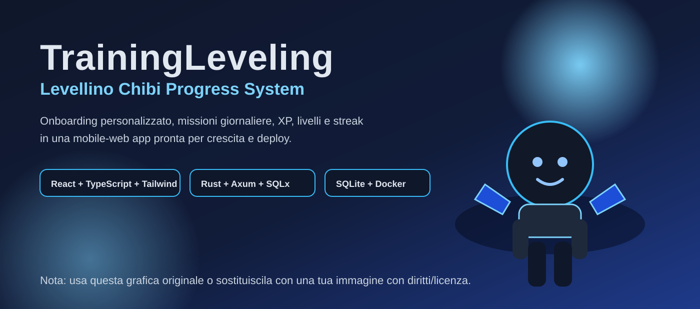
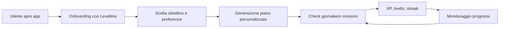
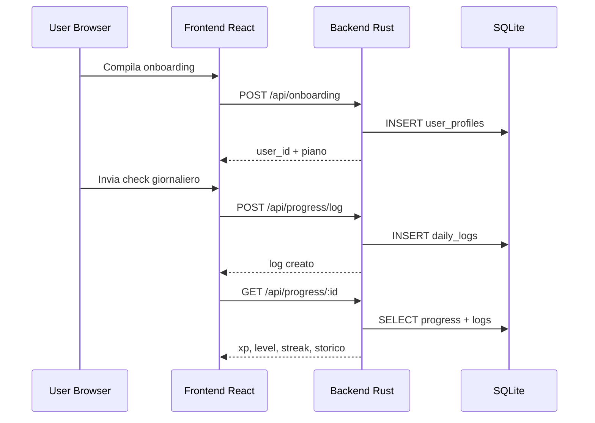
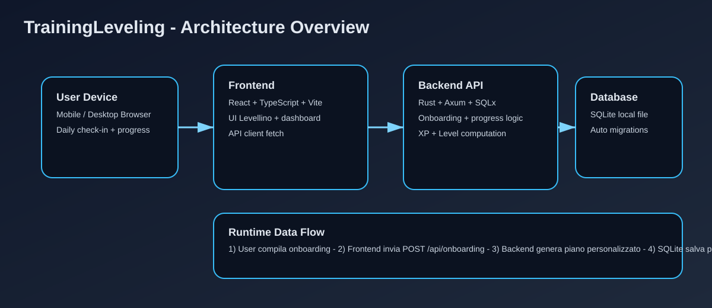
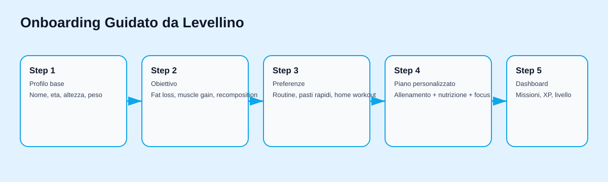
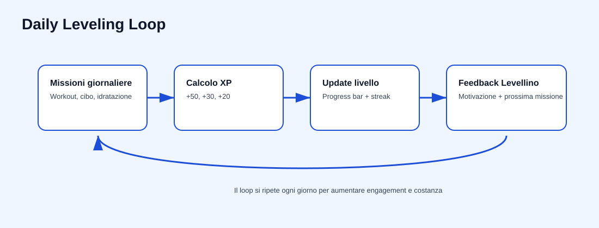
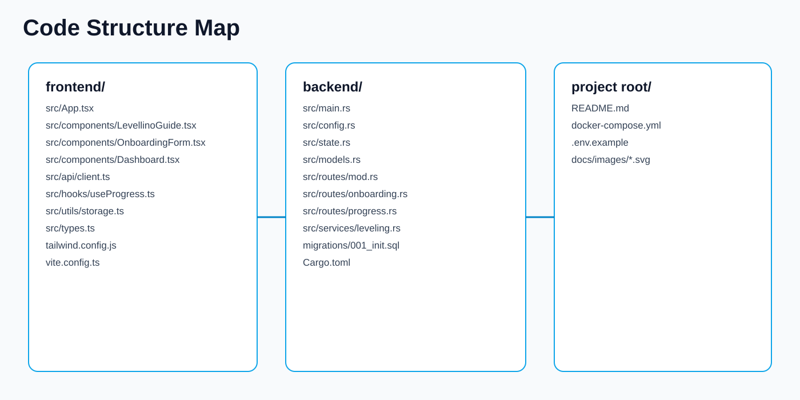
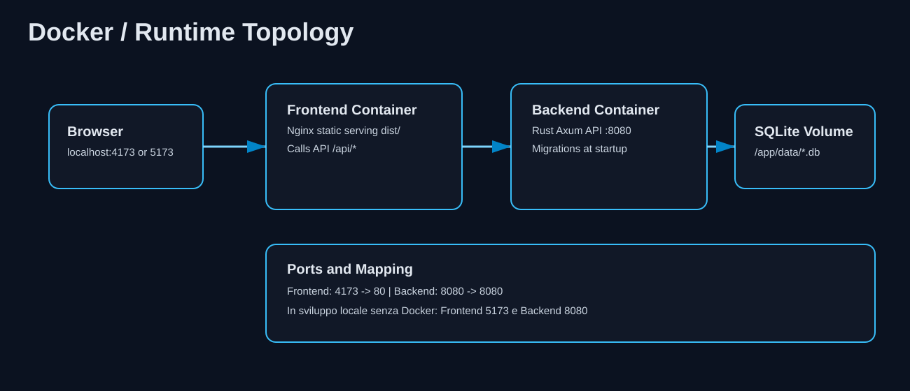
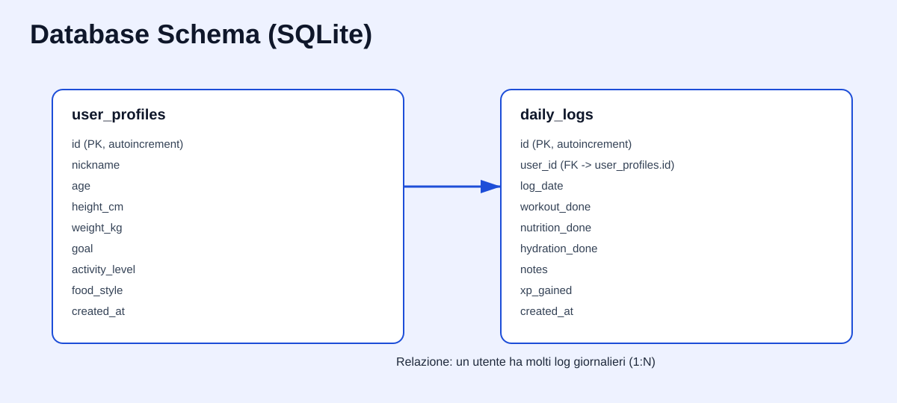

<p align="center">
  
</p>

<h1 align="center">TrainingLeveling</h1>

<p align="center">
  Mobile-web app con onboarding guidato, piani personalizzati, missioni giornaliere, XP e level-up.
</p>

<p align="center">
  
  
  
  
</p>

---

## Nota su immagine "Solo Leveling"

Per policy copyright non includo immagini ufficiali protette da franchise nel repository.
Hai pero due opzioni:
1. Usare il visual hero originale gia presente in [docs/images/hero-levellino.svg](docs/images/hero-levellino.svg).
2. Sostituire il file hero con una tua immagine licenziata/di cui possiedi i diritti.

---

## Indice

- [Quick Start](#quick-start)
- [Percorso Utente e Tecnico](#percorso-utente-e-tecnico)
- [Architettura Visuale Completa](#architettura-visuale-completa)
- [Mappa Codice con Collegamenti](#mappa-codice-con-collegamenti)
- [Docker Topology](#docker-topology)
- [Database Schema](#database-schema)
- [API Endpoints](#api-endpoints)
- [Runbook Avvio](#runbook-avvio)
- [Troubleshooting](#troubleshooting)

---

## Quick Start

### Avvio locale diretto

```bash
cd backend
copy .env.example .env
cargo run
```

Secondo terminale:

```bash
cd frontend
copy .env.example .env
npm install
npm run dev
```

URL:
- Frontend: http://localhost:5173
- Backend health: http://localhost:8080/api/health

### Avvio con Docker (se installato)

```bash
docker compose up --build
```

URL:
- Frontend: http://localhost:4173
- Backend health: http://localhost:8080/api/health

---

## Percorso Utente e Tecnico

### User Journey



### Technical Request Flow



---

## Architettura Visuale Completa

### 1) Overview architettura



### 2) Flusso onboarding



### 3) Daily leveling loop



### 4) Mappa struttura codice



### 5) Topologia Docker/runtime



### 6) Schema database



---

## Mappa Codice con Collegamenti

### Frontend

| Modulo | Scopo |
|---|---|
| [frontend/src/main.tsx](frontend/src/main.tsx) | Entry point React |
| [frontend/src/App.tsx](frontend/src/App.tsx) | Shell principale + routing UI base |
| [frontend/src/components/LevellinoGuide.tsx](frontend/src/components/LevellinoGuide.tsx) | Hero/guida Levellino |
| [frontend/src/components/OnboardingForm.tsx](frontend/src/components/OnboardingForm.tsx) | Form onboarding utente |
| [frontend/src/components/Dashboard.tsx](frontend/src/components/Dashboard.tsx) | Dashboard, missioni, progresso |
| [frontend/src/api/client.ts](frontend/src/api/client.ts) | Chiamate HTTP al backend |
| [frontend/src/hooks/useProgress.ts](frontend/src/hooks/useProgress.ts) | Hook stato progresso |
| [frontend/src/utils/storage.ts](frontend/src/utils/storage.ts) | Persistenza locale user/onboarding |
| [frontend/src/types.ts](frontend/src/types.ts) | Tipi TypeScript condivisi |

### Backend

| Modulo | Scopo |
|---|---|
| [backend/src/main.rs](backend/src/main.rs) | Bootstrap server, CORS, migration startup |
| [backend/src/config.rs](backend/src/config.rs) | Config ENV e default runtime |
| [backend/src/state.rs](backend/src/state.rs) | Stato globale app (pool DB) |
| [backend/src/models.rs](backend/src/models.rs) | DTO request/response + entity log |
| [backend/src/routes/mod.rs](backend/src/routes/mod.rs) | Registrazione route API |
| [backend/src/routes/health.rs](backend/src/routes/health.rs) | Endpoint health |
| [backend/src/routes/onboarding.rs](backend/src/routes/onboarding.rs) | Creazione profilo + piano |
| [backend/src/routes/progress.rs](backend/src/routes/progress.rs) | Log giornaliero + progress retrieval |
| [backend/src/services/leveling.rs](backend/src/services/leveling.rs) | Regole XP e level computation |
| [backend/migrations/001_init.sql](backend/migrations/001_init.sql) | Schema SQLite iniziale |

### Infra/Config

| File | Scopo |
|---|---|
| [docker-compose.yml](docker-compose.yml) | Runtime container frontend/backend + volume SQLite |
| [backend/.env.example](backend/.env.example) | Env backend di riferimento |
| [frontend/.env.example](frontend/.env.example) | Env frontend di riferimento |
| [.env.example](.env.example) | Template env root |

---

## Docker Topology

Composizione stack docker:
- frontend container serve asset statici
- backend container espone API Rust
- volume sqlite persistente per dati app

File chiave:
- [docker-compose.yml](docker-compose.yml)
- [backend/Dockerfile](backend/Dockerfile)
- [frontend/Dockerfile](frontend/Dockerfile)

---

## Database Schema

Schema attuale (SQLite):
- `user_profiles`: profilo base utente
- `daily_logs`: log giornalieri e XP
- relazione 1:N su `user_id`

Schema definito in:
- [backend/migrations/001_init.sql](backend/migrations/001_init.sql)

---

## API Endpoints

### GET /api/health
Controllo stato backend.

### POST /api/onboarding
Crea profilo utente e ritorna piano iniziale.

### POST /api/progress/log
Registra completamento missioni giornaliere e calcola XP.

### GET /api/progress/:user_id
Ritorna livello, XP, streak e storico log.

---

## Runbook Avvio

### Modalita sviluppo
1. Avvia backend da [backend](backend)
2. Avvia frontend da [frontend](frontend)
3. Apri URL frontend
4. Verifica health API

### Modalita container
1. Verifica docker installato
2. Avvia `docker compose up --build`
3. Apri frontend su porta 4173

---

## Troubleshooting

### Errore `Failed to fetch` nel frontend
- verifica backend su http://localhost:8080/api/health
- controlla [frontend/.env](frontend/.env) con `VITE_API_BASE_URL=http://localhost:8080`

### Porta occupata
- backend usa 8080
- frontend usa 5173 (dev) o 4173 (docker)

### DB non accessibile
- in locale usa SQLite automatico (nessuna credenziale richiesta)
- controlla file DB in [backend/training_leveling.db](backend/training_leveling.db)

---

## Estensioni Future

- auth JWT + refresh token
- motore piani avanzato con macro/calorie
- notifiche e reminder
- analytics avanzate
- migrazione opzionale a PostgreSQL/MySQL per scala enterprise
